# 🗂️ Entity Relationship Diagram - SpeakFuel Database

## 📊 Diagrama Principal


## 🔐 Diagrama de Autenticación y Pagos


## 🎯 Estados de Lecciones


## 💰 Flujo de Sistema de Pagos

```mermaid
sequenceDiagram
    participant U as Usuario
    participant C as /checkout API
    participant S as Stripe
    participant P as /process-payment API
    participant DB as Supabase
    participant E as Email Service
    
            U->>C: POST /api/checkout {email}
        C->>DB: check_user_paid_access(email)
        
        alt Usuario ya tiene acceso
            DB-->>C: {has_access: true}
            C-->>U: Error: Ya tienes acceso
            C->>U: Redirige a /auth/login
    else Usuario nuevo
        DB-->>C: {has_access: false}
        C->>S: Crear sesión checkout
        S-->>C: session_id
        C-->>U: Redirige a Stripe
        
        U->>S: Completa pago
        S->>U: Redirige a /auth/signup?session_id=xxx&email=xxx
        
        U->>P: GET /auth/signup (automático)
        P->>S: Verificar sesión
        S-->>P: customer_email
        
        P->>DB: Crear/encontrar usuario
        P->>DB: grant_paid_access(email)
        P-->>U: Página de signup con opciones auth
        U->>P: Google OAuth o Email/Password
        P-->>U: Acceso inmediato al dashboard
    end
```



## 🔄 Flujo de Progreso de Lecciones


## 🏗️ Índices y Constraints


## 📈 Queries de Performance

### **Query Plan: Verificar Acceso Pagado**
```sql
-- Optimizada con índice en purchase_email
EXPLAIN ANALYZE
SELECT au.id, up.has_paid_access 
FROM auth.users au
JOIN user_profiles up ON au.id = up.id
WHERE au.email = 'user@example.com'
  AND up.has_paid_access = true;

-- Index Scan on user_profiles (cost=0.15..8.17)
-- Index Condition: (has_paid_access = true)
```

### **Query Plan: Progreso de Usuario**
```sql
-- Optimizada con índice en user_id
EXPLAIN ANALYZE
SELECT lesson_id, status, repetitions_completed
FROM user_lesson_progress
WHERE user_id = 'user-uuid'
ORDER BY lesson_id;

-- Index Scan on user_lesson_progress (cost=0.15..25.88)
-- Index Condition: (user_id = 'user-uuid')
```

### **Query Plan: Actividad Reciente**
```sql
-- Optimizada con índice compuesto
EXPLAIN ANALYZE
SELECT activity_date, lessons_completed
FROM user_daily_activity
WHERE user_id = 'user-uuid'
  AND activity_date >= CURRENT_DATE - INTERVAL '30 days'
ORDER BY activity_date DESC;

-- Index Scan on user_daily_activity (cost=0.15..15.45)
-- Index Condition: (user_id = 'user-uuid' AND activity_date >= ...)
```

## 🛡️ Seguridad RLS

```mermaid
graph TB
    subgraph "Row Level Security"
        RLS1[user_profiles: auth.uid() = id]
        RLS2[user_lesson_progress: auth.uid() = user_id]
        RLS3[user_daily_activity: auth.uid() = user_id]
    end
    
    subgraph "Security Functions"
        SF1[SECURITY DEFINER]
        SF2[check_user_paid_access]
        SF3[grant_paid_access]
        SF4[complete_lesson_section]
        SF5[update_user_streak]
    end
    
    RLS1 --> |Protege| PROF[Datos de perfil]
    RLS2 --> |Protege| PROG[Progreso de lecciones]
    RLS3 --> |Protege| ACT[Actividad diaria]
    
    SF1 --> SF2
    SF1 --> SF3
    SF1 --> SF4
    SF1 --> SF5
    
    style RLS1 fill:#ffebee
    style RLS2 fill:#ffebee
    style RLS3 fill:#ffebee
    style SF1 fill:#e8f5e8
```

## 📊 Métricas y Analytics

### **Dashboard de Métricas Sugeridas**


## 🔧 Comandos de Mantenimiento

### **Backup Strategy**
```sql
-- Backup completo diario
pg_dump --host=db.xxx.supabase.co --port=5432 --username=postgres --dbname=postgres --schema=public --data-only --file=backup_$(date +%Y%m%d).sql

-- Backup solo estructura
pg_dump --host=db.xxx.supabase.co --port=5432 --username=postgres --dbname=postgres --schema=public --schema-only --file=schema.sql
```

### **Limpieza de Datos**
```sql
-- Limpiar actividad antigua (>1 año)
DELETE FROM user_daily_activity 
WHERE activity_date < CURRENT_DATE - INTERVAL '1 year';

-- Vacuum para recuperar espacio
VACUUM ANALYZE user_daily_activity;
```

### **Monitoring Queries**
```sql
-- Usuarios activos última semana
SELECT COUNT(DISTINCT user_id) as weekly_active_users
FROM user_daily_activity
WHERE activity_date >= CURRENT_DATE - INTERVAL '7 days';

-- Pagos del mes actual
SELECT COUNT(*), SUM(29) as revenue_usd
FROM user_profiles
WHERE has_paid_access = true
  AND purchase_date >= date_trunc('month', CURRENT_DATE);
``` 